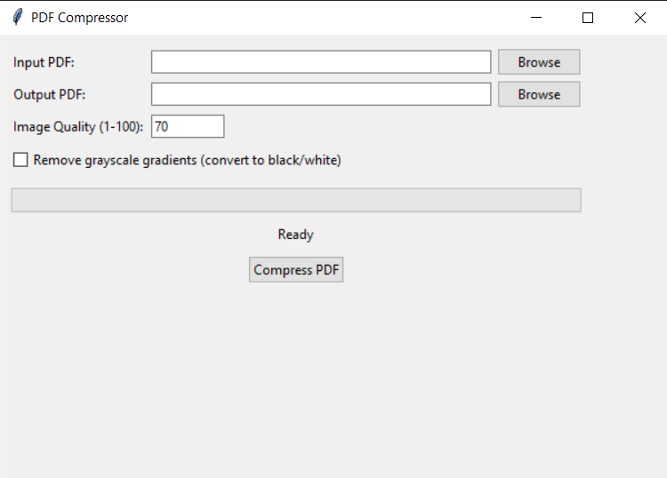

# PDF Compressor

[English](#english) | [Русский](#русский)

---


<a name="english"></a>
## English

A Python application with a graphical user interface for compressing PDF files by reducing image quality and optimizing the PDF structure.

## Features

- Compress PDF files by reducing image quality
- Remove grayscale gradients option (convert to black/white)
- Graphical interface with progress tracking
- Display compression statistics

## Running

### Install Dependencies

```bash
pip install -r requirements.txt
```

### Run Application

```bash
python src/pdf_compressor.py
```

In the interface:
1. Select input PDF file
2. Specify output file path
3. Set image quality (1-100)
4. Optionally enable "Remove grayscale gradients"
5. Click "Compress PDF"

## Building Windows Executable

To create an executable file:

1. Install PyInstaller:
```bash
pip install pyinstaller
```

2. Run the build script:
```bash
build_windows.bat
```

Or use the spec file:
```bash
build_windows_spec.bat
```

The executable will be created in the `dist` folder as `PDF Compressor.exe`.

## Requirements

- Python 3.7+
- PyMuPDF
- Pillow
- pikepdf
- tkinter (usually comes with Python)

## License

MIT License - see [LICENSE](LICENSE)

---

# Русский

Приложение для сжатия PDF файлов с графическим интерфейсом. Уменьшает размер файлов за счет снижения качества изображений и оптимизации структуры PDF.

## Функционал

- Сжатие PDF файлов путем снижения качества изображений
- Опция удаления градиентов (конвертация в черно-белое)
- Графический интерфейс с отслеживанием прогресса
- Отображение статистики сжатия

## Запуск

### Установка зависимостей

```bash
pip install -r requirements.txt
```

### Запуск приложения

```bash
python src/pdf_compressor.py
```

В интерфейсе:
1. Выберите входной PDF файл
2. Укажите путь для сохранения сжатого файла
3. Установите качество изображений (1-100)
4. При необходимости включите опцию "Remove grayscale gradients"
5. Нажмите "Compress PDF"

## Компиляция Windows Executable

Для создания исполняемого файла:

1. Установите PyInstaller:
```bash
pip install pyinstaller
```

2. Запустите скрипт сборки:
```bash
build_windows.bat
```

Или используйте spec файл:
```bash
build_windows_spec.bat
```

Исполняемый файл будет создан в папке `dist` как `PDF Compressor.exe`.

## Требования

- Python 3.7+
- PyMuPDF
- Pillow
- pikepdf
- tkinter (обычно входит в состав Python)

## Лицензия

MIT License - см. [LICENSE](LICENSE)
